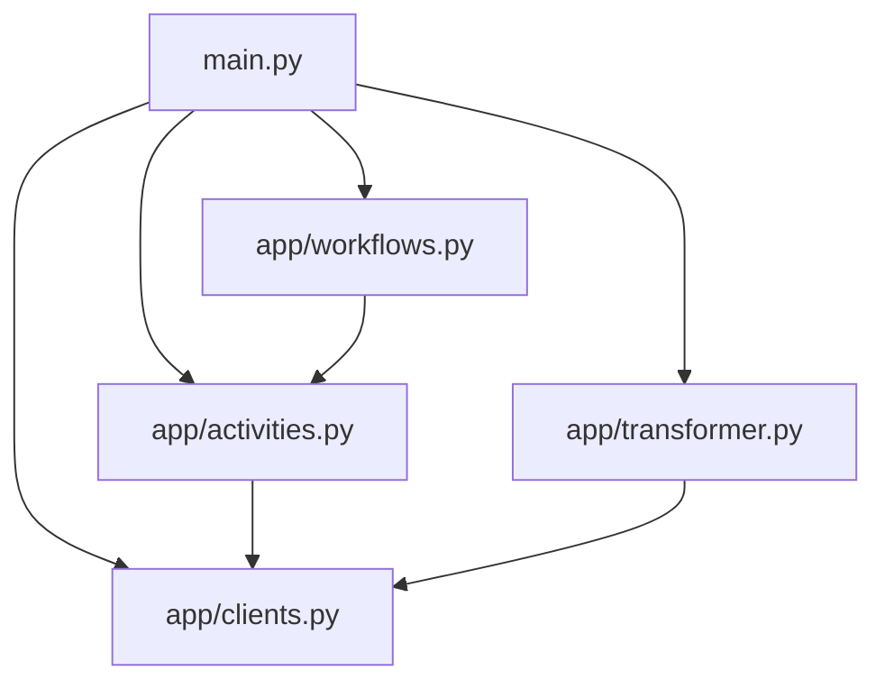

# 🚀 Supabase App

A powerful application that extracts metadata from Supabase databases and transforms it into a standardized format. Built with Application SDK for robust workflow management.

## Prerequisites

- Python 3.11+
- [uv](https://docs.astral.sh/uv/) package manager
- [Dapr CLI](https://docs.dapr.io/getting-started/install-dapr-cli/)
- [Temporal CLI](https://docs.temporal.io/cli)
- Supabase database access

### Installation Guides
- [macOS Setup Guide](https://github.com/atlanhq/application-sdk/blob/main/docs/docs/setup/MAC.md)
- [Linux Setup Guide](https://github.com/atlanhq/application-sdk/blob/main/docs/docs/setup/LINUX.md)
- [Windows Setup Guide](https://github.com/atlanhq/application-sdk/blob/main/docs/docs/setup/WINDOWS.md)

## Quick Start

1. **Download required components:**
   ```bash
   uv run poe download-components
   ```

2. **Set up environment variables (see .env.example)**

3. **Start dependencies (in separate terminal):**
   ```bash
   uv run poe start-deps
   ```

4. **Run the application:**
   ```bash
   uv run main.py
   ```

**Access the application:**
- **Web Interface**: http://localhost:8000
- **Temporal UI**: http://localhost:8233

## Features

- Automated metadata extraction from Supabase databases
- Structured workflow for database, schema, table, and column extraction
- Real-time workflow status tracking
- Robust error handling and retry mechanisms
- Standardized metadata transformation
- Support for Supabase-specific features like:
  - Row Level Security (RLS) detection
  - Schema categorization (auth, storage, public, system)
  - JSONB and UUID column identification
  - SSL connection validation
  - Supabase-specific table and column categorization

## Project Structure



```
supabase/
├── app/                # Core application logic
│   ├── sql/           # SQL query templates
│   ├── activities.py  # Database interaction activities
│   ├── clients.py     # Supabase client implementation
│   ├── transformer.py # Metadata transformation logic
│   └── workflows.py   # Workflow definitions and orchestration
├── components/         # Dapr components (auto-downloaded)
├── frontend/           # Web interface assets
├── deploy/            # Installation and deployment files
├── local/              # Local data storage
├── models/             # Data models and schemas
├── main.py             # Application entry point and initialization
├── pyproject.toml      # Dependencies and config
└── README.md           # This file
```

## Development

### Stop Dependencies
```bash
uv run poe stop-deps
```

### Run Tests
```bash
uv run pytest
```

> [!NOTE]
> Make sure you have a `.env` file that matches the [.env.example](.env.example) file in this directory.

## Workflow Process

1. **Initialization**: The application sets up the Supabase client and workflow components
2. **Preflight Check**: Validates database connectivity and SSL connection
3. **Metadata Extraction**:
   - Fetches database information
   - Extracts schema details with Supabase-specific categorization
   - Retrieves table metadata including RLS information
   - Gathers column information with Supabase-specific attributes
4. **Transformation**: Converts raw metadata into standardized format
5. **Output**: Saves the transformed metadata to specified location

## Supabase-Specific Features

This connector includes Supabase-specific metadata extraction:

- **Database Information**: Extracts the main Supabase database
- **Schema Details**: Includes schema categorization:
  - `public` - User-defined tables and data
  - `auth` - Authentication and user management
  - `storage` - File storage and management
  - `supabase_*` - Supabase system schemas
- **Table Statistics**: Retrieves table size, row counts, and maintenance statistics
- **Row Level Security**: Detects tables with RLS enabled
- **Column Metadata**: Comprehensive column information including:
  - Supabase-specific data types (JSONB, UUID)
  - Column categorization (foreign keys, timestamps, etc.)
  - Generated columns and identity columns
  - Default values and descriptions

## Getting Supabase Connection Details

1. **Go to your Supabase project dashboard**
2. **Navigate to Settings → Database**
3. **Find the connection details:**
   - **Host**: `db.[project-ref].supabase.co`
   - **Port**: `5432`
   - **Database**: `postgres`
   - **Username**: `postgres`
   - **Password**: Your database password

## Example Configuration

```
Host: db.abcdefghijklmnop.supabase.co
Port: 5432
Username: postgres
Password: [your-supabase-password]
Database: postgres
Connection Name: my-supabase-project
```

## Learning Resources

- [Atlan Application SDK Documentation](https://github.com/atlanhq/application-sdk/tree/main/docs)
- [Supabase Documentation](https://supabase.com/docs)
- [PostgreSQL Documentation](https://www.postgresql.org/docs/)
- [Python FastAPI Documentation](https://fastapi.tiangolo.com/)

## Contributing

We welcome contributions! Please feel free to submit a Pull Request.

# source-sense